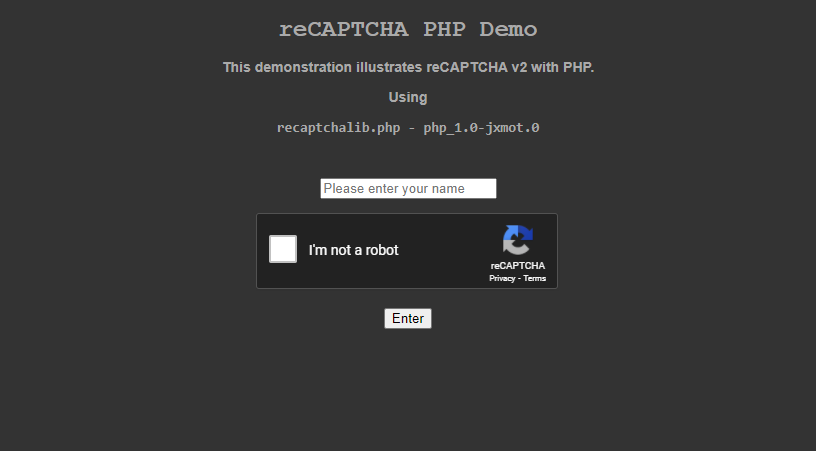
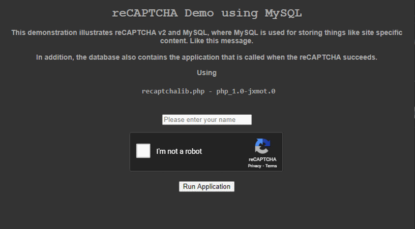

# reCAPTCHA - A Basic Example Using PHP and MySQL

- [Overview](#overview)
  * [History](#history)
- [Minimum Requirements](#minimum-requirements)
  * [reCAPTCHA and localhost](#recaptcha-and-localhost)
- [Components](#components)
  * [reCAPTCHA v1.2.4](#recaptcha-v124)
- [Running the Demonstration](#running-the-demonstration)
  * [Screen Shot](#screen-shot)
- [Extras](#extras)
  * [Form User Name](#form-user-name)
  * [Hit Counter and Caller ID](#hit-counter-and-caller-id)
  * [Using MySQL](#using-mysql)
- [Future](#future)

# Overview

The files contained in this repository are intended to demonstrate some methods of implementing Google's **reCAPTCHA V2**. The primary coding language is PHP and it used for program logic and for aiding in rendering content to the client. 

## History

This project started out as means to have a reCAPTCHA as part of an entry page to a photo gallery. While I was developing the entry page I realized that designing it with *reuse* as a priority was a good idea. So now each new use of this code only requires two things:

* A unique page identifier. A text string is sufficient - **`demo_01`**. 
* A row in a database table populated with the necessary data.

Those design choices led to the use of MySQL to store reCAPTCHA specific configuration data and page content. The initial version of PHP code that was provided by Google at that time (*[1.0.0](<https://github.com/google/recaptcha/tree/1.0.0>)*) was a single 5kb PHP source file and one PHP example file. The `index.php` is based on that example.

A live demonstration can be viewed **[here](<https://www.jamesmotyl.com/demos/recaptcha/>)**.

# Minimum Requirements

* An internet web server capable of **https**, or a local **http** server (*for development*) running on your PC. 
* PHP 7.x or newer.
* You must sign up for a reCAPTCHA account and obtain the site key and secret for your site. Start [here](<https://www.google.com/recaptcha/intro/index.html>). 

**NOTE:** MySQL is not required for running the demonstration.

## reCAPTCHA and localhost

**Important:** If you are running your server locally on your PC it will be necessary to add `localhost` to the list of servers in Google's reCAPTCHA console. Go to **_Key Settings_** and add the following lines to the **_Domains_** box - 

```
localhost
127.0.0.1
```

# Components

The following files are needed for used for the demonstration - 

* `index.php` - manages the reCAPTCHA widget and contains a form with a field for a user name and a submit button. 
* `recaptchalib.php` - this is the *orginal*, I've updated it to eliminate some PHP >v7 deprecation warnings.
* `site.php` - a configuration file. It contains the reCAPTCHA settings and target page URL:

```php
<?php
$_site_id = 'demo_01';
define('SITE_ID', $_site_id);

/*
    Register API keys at - 
        https://www.google.com/recaptcha/admin

    reCAPTCHA supported 40+ languages listed here -
        https://developers.google.com/recaptcha/docs/language
*/
define('SITE_KEY', 'YOUR RECAPTCHA SITE KEY GOES HERE');
define('SITE_SECRET', 'YOUR RECAPTCHA SECRET GOES HERE');
/*
    Language setting used by our HTML and required by the
    reCAPTCHA api. The charset is only used in our HTML.
*/
define('SITE_LANG', 'en');
define('SITE_CHARSET', 'UTF-8');
// the page that is loaded upon passing the reCAPTCHA and
// entering a user name
define('SITE_APPL', './phpinfo.php');
/*
    some page elements
*/
define('PAGE_TITLE', 'reCAPTCHA PHP Demo');
define('PAGE_HEADING', 'reCAPTCHA PHP Demo');
define('PAGE_MESSAGE', 'This demonstration illustrates reCAPTCHA v2 with PHP.');
// Submit button caption
define('FORM_SUBMIT', 'Enter');
// reCAPTCHA theme (light or dark)
define('RECAPTCHA_THEME', 'dark');
?>
```
**Field Descriptions:**

* Site ID - a unique string used for identifying the specific site using this reCAPTCHA
* reCAPTCHA *site key* and *site secret*
* Site Language - used in `index.php` within the `<HTML>` tag and for setting the reCAPTCHA language
* Site Character Set - used in `index.php` within the `<META>` tag and for setting the page character set
* Site Application - a string that contains a path and file that are loaded upon success from reCAPTCHA, this can also be a URL
* Page Title - the title for the page generated by `index.php`
* Page heading - the `<H1>` page heading
* Page Message - any content (*including HTML*) to be used as a message to the user
* Form Submit Button Caption - the caption to be used in the submit button
* reCAPTCHA Theme - `light` or `dark` are the only two choices allowed by reCAPTCHA

## reCAPTCHA v1.2.4

Starting with v1.1.0 the reCAPTCHA support code was no longer a single PHP file. It grew into something that IMHO is way more complex than it needs to be. And in its current form the code will not work easily. In order to use it you would need *Composer* to install it and in general it seems to be written to run in the Google *cloud*.

Personally, I'm not *against* Composer. In the right development environment it's perfect. But for my *intended use* Composer is not an option.

In this repository you will find a *modified* v1.2.4 in the `ReCaptcha` folder. And this demo will work with ether v1.0.0 or v1.2.4. By default the V1.0.0 version will be used.

The library version is selected in `index.php`, line 8. The default is to use `recaptchalib.php`.

```php
// if false or undefined then recaptchalib.php will be used
// if true then the slightly modified v1.2.4 will be used
define('USE_V124', false);
```

### Files

* `ReCaptcha\*.*` - This is v1.2.4, obtained from the [reCAPTCHA PHP client library](<https://github.com/google/recaptcha>). I made some modifications to it:
    * Composer is no longer required to install it. 
    * `POST` and `Curl`classes have been modified, and the methods have been tested. I did not modify or test the `Socket` method.

# Running the Demonstration

To prepare for first run edit `site.php` and change the following as needed - 

* line 2 : unique identifier for this reCAPTCHA site.
* line 12 : your reCAPTCHA *site key* goes here
* line 13 : your reCAPTCHA *secret* goes here
* line 22 : this where you would put the path + file for your specific use. For the first test leave this line as-is. A complete URL is also allowed here.
* lines 26, 27, 28  : reCAPTCHA page title, heading, and message.
* line 30 : Submit button caption
* line 32 : reCAPTCHA theme - `light` or `dark`

**Then follow these steps :**

1. Copy all of the files into a folder on your server. Be careful! Don't put it in your web document root. Place it in a sub-folder so you don't over write any existing `index.php` files
2. Use your browser and go to `https://yourserver/optional-path/`, where `optional-path` is where you placed the files.
3. Fill in the name field and click the submit button.
4. The `phpinfo.php` should load and display information about the PHP installation on your server.

## Screen Shot

If your reCAPTCHA *site key*, *secret*, and *domains* have been set properly, and your server is running then you should see the following - 

<p align="center">
  
  <h4 align="center">
      reCAPTCHA Demo
  </h4>
</p>

# Extras

## Form User Name

The user name field is saved in a PHP session as `$_SESSION['userName']`. This makes it available to the `SITE_APPL` page. And the demonstration *in this repository* the file `phpinfo.php` will display the user name at the top of the page when it is loaded. The site ID is also displayed.

## Hit Counter and Caller ID

There are two files unrelated to reCAPTCHA, they are `count.php` and `callerid.php`. Although commented out, they're called in `index.php` on lines 61 and 62. And are commented out as default. The following sections describe their behaviors.

**`count.php` :**

This file maintains a hit counter in a text file that is saved in the same folder where `count.php` is used. The file is named `siteID_count.log`. Where `siteID` is the string that had been configured above. If using the demonstration settings that string will be `demo_01`.

If the counter file does not exist the first time `count.php` is ran it will be created automatically.

**`callerid.php` :**

This file maintains a text file that is saved in the same folder where `callerid.php` is used. The file is named `siteID_callerid.log`. Where `siteID` is the string that had been configured above. If using the demonstration settings that string will be `demo_01`.

For each visitor a time stamped record with the visitors IP address is created - 

`2017/02/18 - 18:42:27 > 66.102.7.192`

If the log file does not exist the first time `callerid.php` is ran it will be created automatically. In additon, if the file exceeds approximately 20k in size it is copied to a time stamped back up copy and a new caller ID log is created. The time stamp in the file name will be the date and time when the *back up* is created.

## Using MySQL

Everything found in `site.php`, except the site ID can be stored in a database. To enable MySQL use edit the `index.php` file and change `USE_MYSQL` to `true`:

```php
// control over the use of MySQL
define('USE_MYSQL', false);
```

The following files are used when MySQL is enabled:

* `sitedb.php` - a configuration file that contains all of the MySQL code and settings. It obtains the reCAPTCHA settings and target page URL from the MySQL database.
* `sql/create_table.sql` - an SQL script file that creates the `site` table.
* `sql/seed.sql` - an SQL script file that seeds a single row.

<br>
<p align="center">
  
  <h4 align="center">
      reCAPTCHA Demo - With MySQL Database
  </h4>
</p>

# Future

* An administration form is planned that will allow an admin user to enter sites into the database.
* Might create a MongoDB version.

<p align="center">
(c) 2017-2020 Jim Motyl
</p>

---

