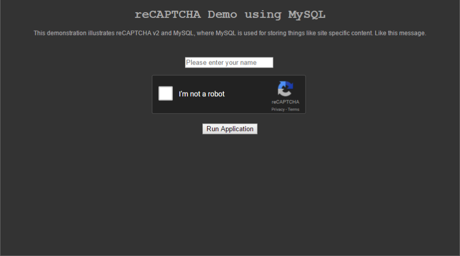

# reCAPTCHA - A Basic Example Using PHP and MySQL

* [Overview](https://bitbucket.org/jxmot/recaptcha/overview#markdown-header-overview)
    * [History](https://bitbucket.org/jxmot/recaptcha/overview#markdown-header-history)
* [Requirements](https://bitbucket.org/jxmot/recaptcha/overview#markdown-header-requirements)
    * [reCAPTCHA and localhost](https://bitbucket.org/jxmot/recaptcha/overview#markdown-header-recaptcha-and-localhost)
    * [Local Server](https://bitbucket.org/jxmot/recaptcha/overview#markdown-header-local-server)
* [Components](https://bitbucket.org/jxmot/recaptcha/overview#markdown-header-components)
* [Use](https://bitbucket.org/jxmot/recaptcha/overview#markdown-header-use)
    * [With MySQL](https://bitbucket.org/jxmot/recaptcha/overview#markdown-header-with-mysql)
    * [Without MySQL](https://bitbucket.org/jxmot/recaptcha/overview#markdown-header-without-mysql)
    * [Screen Shot](https://bitbucket.org/jxmot/recaptcha/overview#markdown-header-screen-shot)
* [Features](https://bitbucket.org/jxmot/recaptcha/overview#markdown-header-features)
    * [Configuration](https://bitbucket.org/jxmot/recaptcha/overview#markdown-header-configuration)
        * [MySQL Configuration Items](https://bitbucket.org/jxmot/recaptcha/overview#markdown-header-mysql-configuration-items)
    * [Form User Name](https://bitbucket.org/jxmot/recaptcha/overview#markdown-header-form-user-name)
    * [Hit Counter and Caller ID](https://bitbucket.org/jxmot/recaptcha/overview#markdown-header-hit-counter-and-caller-id)

# Overview

The files contained in this repository are intended to demonstrate the use of reCAPTCHA. I've used a previous version of the code here to create a simple "bot proof" entry into a photo gallery on one of my sites.

## History

As an *improvement* to the gallery version I decided to use a MySQL database to store configuration data instead of hard-coding it in the original `site.php` file. That allows me to easily use this code in other applications with only a single line change. And providing that a corresponding row of data exists within the database.

# Requirements

* An internet web server capable of **https**, or a local **http** server (*for development*) running on your PC. 
* PHP 5.6 or newer.
* You must sign up for a reCAPTCHA account and obtain the site key and secret for your site. Start here - <https://www.google.com/recaptcha/intro/index.html>. 

## reCAPTCHA and localhost

Before you can use reCAPTCHA when serving from *localhost* you will need to go to **_Key Settings_** and add the following lines to the **_Domains_** box - 

`localhost`
`127.0.0.1`

## Local Server

My preference for a local HTTP server is MAMP(<https://www.mamp.info/en/>). There are alternatives, including a virtual machine. However MAMP is very easy to use and there's a *free* version. The free version also includes MySQL. However, if you're already running a MySQL server you will need to make modifications to the MAMP server configuration files. A guide can be found in my Toolbox, see <https://bitbucket.org/jxmot/toolbox/MAMP.md>.

# Components

The following files are present - 

* `index.php` - manages the reCAPTCHA widget and contains a form with a field for a user name and a submit button. 
* `sitedb.php` - a configuration file that uses MySQL to store configuration data.
* `site.php` - a configuration file.
* `count.php` - a *invisible* hit counter. It only updates a count in a file specified in `site.php`. It does not display on the page that contains it.
* `callerid.php` - logging of the visitor's ip address and the date and time they visited.
* `phpinfo.php` - only displays information regarding the PHP installation on the server. This is the file that is loaded when the reCAPTCHA succeeds *and* the visitor has filled in the name field and clicked the form's submit button.
* `recaptchalib.php` - obtained from *Google Developers*, for more information see - <https://developers.google.com/recaptcha/docs/faq>
* `sql/create_table.sql` - an SQL script file that creates the `site` table.
* `sql/seed.sql` - an SQL script file that seeds a single row.

# Use

## With MySQL

## Without MySQL

To prepare for first use edit `site.php` and change the following as needed - 

* line 9 : your reCAPTCHA *site key* goes here
* line 10 : your reCAPTCHA *secret* goes here
* line 19 : this where you would put the path + file for your specific use. For the first test leave this line as-is.
* lines 25 and 26 : reCAPTCHA page title and heading.
* line 28 : Submit button caption

Then follow these steps :

1. Copy all of the files into a folder on your server.
2. Use your browser and go to `https://yourserver/optional-path/`, where `optional-path` is where you placed the files.
3. Fill in the name field and click the submit button.
4. The `phpinfo.php` should load and display information about the PHP installation on your server.

## Screen Shot

If your just reCAPTCHA *site key*, *secret*, and *domains* have been set properly, and your server is running then you should see the following - 



# Features

## Configuration

Either the hard-coded (`site.php`) or the MySQL (`sitedb.php`) have the following configurable items - 

* reCAPTCHA *site key* and *site secret*.
* Site ID - a unique string used for identifying the specific site using this reCAPTCHA (*found in* `site.php` *and* `sitedb.php` *as* `$_site_id`)
* Site Language - used in `index.php` within the `<HTML>` tag and for setting the reCAPTCHA language
* Site Character Set - used in `index.php` within the `<META>` tag and for setting the page character set
* Site Application - a string that contains a path and file that are loaded upon success from reCAPTCHA
* Page Title - the title for the page generated by `index.php`
* Page heading - the `<H1>` page heading
* Page Message - any content (*including HTML*) to be used as a message to the user
* Form Submit Button Caption - the caption to be used in the submit button
* reCAPTCHA Theme - `light` or `dark` are the only two choices allowed by reCAPTCHA

### MySQL Configuration Items

The following is only found in `sitedb.php` - 

```php
  $_db_name = 'recaptcha_dev';    // database name
  $_site_table = 'sites';         // table name
  $_db_server = 'localhost';      // MySQL server
  $_db_user = 'root';             // MySQL user 
  $_db_passw = 'root';            // MySQL user's password
```

**NOTE :** Modify the user and password as needed to suit your application's security requirements.

## Form User Name

The user name field is saved in a PHP session as `$_SESSION['userName']`. This makes it available to the `SITE_APPL` page. And in this demo `phpinfo.php` will display the user name at the top of the page when it is loaded. The site ID is also displayed.

## Hit Counter and Caller ID

There are two files unrelated to reCAPTCHA, they are `count.php` and `callerid.php`. Although commented out, they're called in `index.php` on lines 38 and 39. And are commented out as default. The following sections describe their behaviors.

**`count.php` :**

This file maintains a hit counter in a text file that is saved in the same folder where `count.php` is used. Unless `count.php` is modified otherwise it will use a text file named `count.log`. If the counter file does not exist the first time `count.php` is used it will be created automatically.

**`callerid.php` :**

This file maintains a text file that contains a time stamped record with the visitors IP address - 

`2017/02/18 - 18:42:27 > 66.102.7.192`

Unless `callerid.php` is modified otherwise it will use a text file named `callerid.log`. If the log file does not exist the first time `callerid.php` is used it will be created automatically. In additon, if the file exceeds approximately 20k in size it is copied to a time stamped back up copy and a new caller ID log is created.


(c) 2017 Jim Motyl

